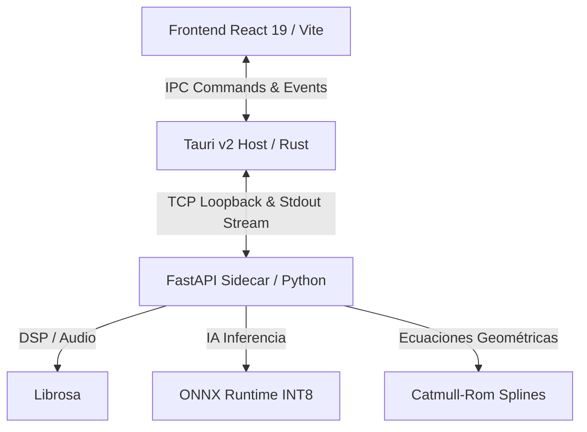

# Karakuri Engine 🚀 — osu! Automapper (Local AI)

**Karakuri Engine** es una aplicación de escritorio nativa de alto rendimiento diseñada para automatizar la creación de mapas rítmicos interactivos (beatmaps) para el videojuego *osu!* de forma **local-first**. El sistema implementa un motor híbrido que fusiona el procesamiento de señales de audio digital (DSP), la inferencia profunda de modelos de inteligencia artificial y restricciones geométricas estrictas.

---

## 🏛️ Arquitectura del Sistema

El proyecto opera bajo una topología de monorepo estructurado en tres capas independientes interconectadas mediante canales asíncronos IPC:



### 1. Capa de Presentación (Frontend)
- **Tecnologías:** React 19, Vite, TailwindCSS, Lucide.
- **Diseño Premium:** Interfaz oscura inmersiva con Glassmorphism y micro-animaciones CSS.
- **Interactividad CRM:** Panel de retención histórica que permite reordenar el orden de los beatmaps generados mediante la biblioteca `dnd-kit` (Drag & Drop) y cargar parámetros rápidamente con la función de reutilización.
- **Telemetría en Tiempo Real:** Gráfico de líneas SVG autoticking que contrasta la CPU global del PC host frente al porcentaje exacto consumido por los hilos de inferencia de la IA.

### 2. Contenedor y Gestor de Ventanas (Tauri v2 & Rust)
- **Modelo de Procesamiento:** Utiliza las WebView nativas del sistema operativo (WebView2 en Windows) para minimizar drásticamente el uso de RAM.
- **Servicios Nativos:**
  - Inyección de diálogos de búsqueda nativos a través de la librería `rfd` (Rusty File Dialog), evitando restricciones de seguridad del navegador.
  - Sincronización local que detecta automáticamente el directorio `%LocalAppData%/osu!/Songs` del usuario e inyecta directamente el archivo `.osz` compilado.
  - Hilo secundario dedicado al monitoreo continuo del sistema (`sysinfo`), capturando métricas de RAM y CPU globales y el PID del sidecar.

### 3. Motor de Inferencia Backend (Python Sidecar)
- **Framework:** FastAPI sobre servidor ASGI Uvicorn, empaquetado autónomamente con PyInstaller.
- **Análisis de Señales:** `Librosa` para la Transformada de Fourier (STFT) y fuerza de inicio en escala Mel.
- **Aceleración local de IA:** `ONNX Runtime` corriendo modelos comunitarios OsuSync pre-entrenados, optimizados dinámicamente mediante cuantización de pesos a precisión de enteros de 8 bits (`QInt8`).

---

## ⚙️ El Pipeline Híbrido de 3 Fases

Cuando ingresas una canción al sistema, el motor ejecuta secuencialmente los siguientes bloques matemáticos:

### Fase 1: Extracción Rítmica (Librosa)
1. **Transformación Mel-Logarítmica:** Convierte la señal de audio unidimensional al dominio de tiempo-frecuencia en escala Mel, aplicando compresión logarítmica:
   $$\mathbf{S}_{log}(f, t) = \ln(1 + \gamma \cdot |X(f, t)|)$$
2. **Novedad Espectral (Spectral Flux):** Evalúa incrementos de energía en múltiples bandas para detectar golpes percusivos (onsets).
3. **Programación Dinámica (Beat Tracking):** Aplica el algoritmo de Ellis para deducir el tempo global (BPM) y los puntos métricos de compás (`TimingPoints`), maximizando la coincidencia con los ataques reales.

### Fase 2: Inferencia Espacial (ONNX)
1. El tensor de marcas rítmicas entra al modelo ONNX pre-cuantizado.
2. Predice las coordenadas cartesianas $(x, y)$ absolutas sobre el campo de juego de osu! ($512 \times 384$).
3. Clasifica el tipo de nota por máscara de bits: Círculos Simples (HitCircles), Deslizadores (Sliders) o Giros (Spinners).

### Fase 3: Restricción Geométrica (Pulido)
1. **Splines Catmull-Rom Centrípeta:** Si la IA predice un deslizador complejo, el pulido aplica una spline paramétrica con coeficiente $\alpha = 0.5$ para garantizar curvas continuas, naturales y sin bucles de intersección.
2. **Normalización del Espaciado (Distance Snap):** Ajusta los saltos espaciales para que la distancia en pantalla sea directamente proporcional a la velocidad y duración musical de las notas, evitando notas físicamente inalcanzables.

---

## 🛠️ Instalación y Configuración de Desarrollo

### Requisitos Previos
- **Node.js** (v18 o superior)
- **Rust & Cargo** (v1.77.2 o superior)
- **Python 3.10+** (para desarrollo del sidecar)

### Paso 1: Clonar el Repositorio
```bash
git clone https://github.com/StaliParra5/Karakuri-Engine.git
cd "Karakuri Engine"
```

### Paso 2: Configurar el Backend (Python)
1. Crea un entorno virtual dentro de la carpeta `engine/`:
   ```bash
   cd engine
   python -m venv .venv
   ```
2. Activa el entorno virtual:
   - **Windows (PowerShell):** `.venv\Scripts\Activate.ps1`
   - **macOS/Linux:** `source .venv/bin/activate`
3. Instala las dependencias:
   ```bash
   pip install -r requirements.txt
   ```
4. Regresa al directorio raíz:
   ```bash
   cd ..
   ```

### Paso 3: Configurar el Frontend e Iniciar
1. Instala los paquetes de Node:
   ```bash
   npm install
   ```
2. Ejecuta la aplicación en modo desarrollo (Tauri Desktop):
   ```bash
   npm run tauri:dev
   ```
   *(Nota: Esto levantará el servidor web Vite en el puerto `1420`, compilará el binario Rust en segundo plano y lanzará el sidecar de Python de forma automática).*

3. **Modo Web Sandbox (Opcional):**
   Si prefieres ejecutar el frontend directamente en tu navegador favorito:
   ```bash
   npm run dev
   ```
   El dashboard abrirá en `http://localhost:5173`. En este modo, si no tienes el backend de Python corriendo, la aplicación conmutará a modo **Sandbox**, simulando todo el pipeline de análisis con telemetrías dinámicas de CPU y RAM interactivas.

---

## 🎮 Instrucciones de Uso

1. **Cargar Audio:** Haz clic en **"Browse File"** o arrastra un archivo `.mp3`, `.ogg` o `.wav`.
2. **Configurar Parámetros:** Especifica el Título, Artista, Creador y desliza el slider de **Intensidad** (esto modifica el multiplicador de espaciado y dificultad en el pulido final).
3. **Cargar Fondo (Opcional):** Selecciona una imagen `.jpg` o `.png` para el beatmap.
4. **Analizar:** Haz clic en **"Start analysis"**. Observa la progresión del pipeline y la reacción de la telemetría en tiempo real.
5. **Jugar:** Si estás en Tauri, abre el cliente de *osu!*, ve a la pantalla de selección de canciones y presiona `F5` para refrescar el catálogo. ¡Tu nuevo mapa inteligente local estará listo para jugar!

